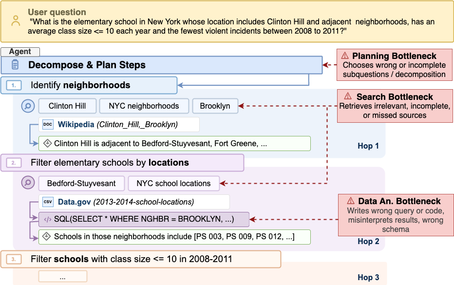
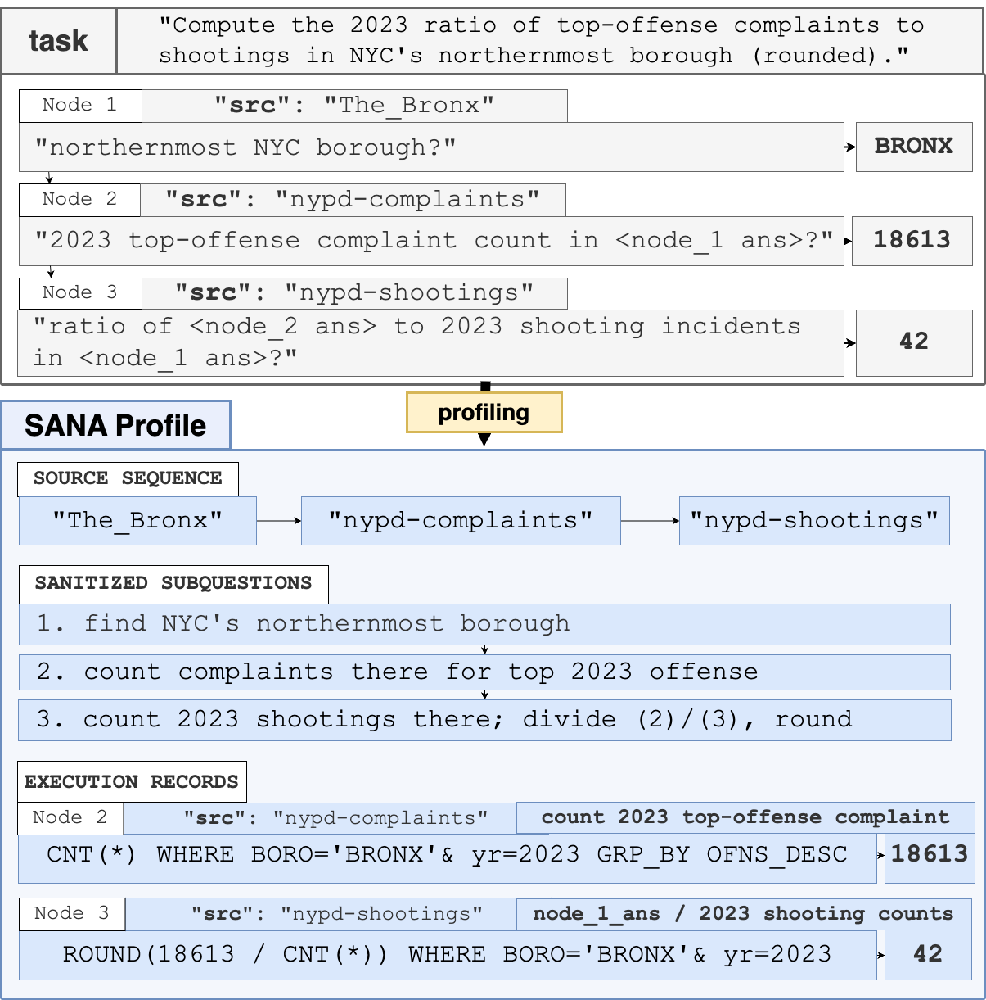
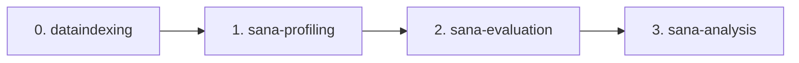
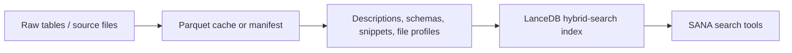
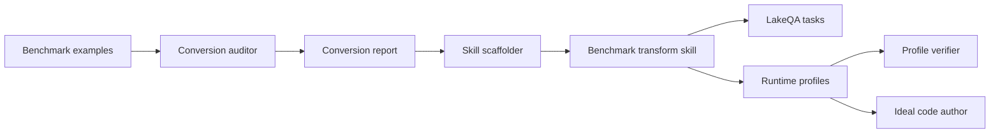
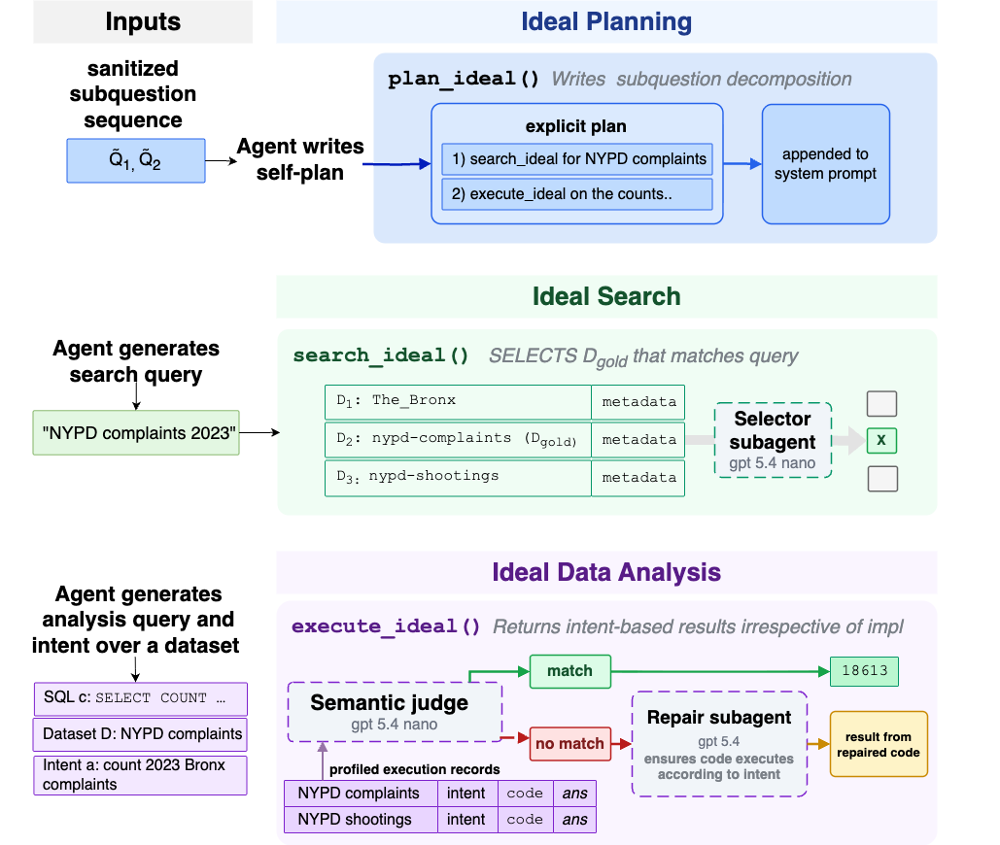
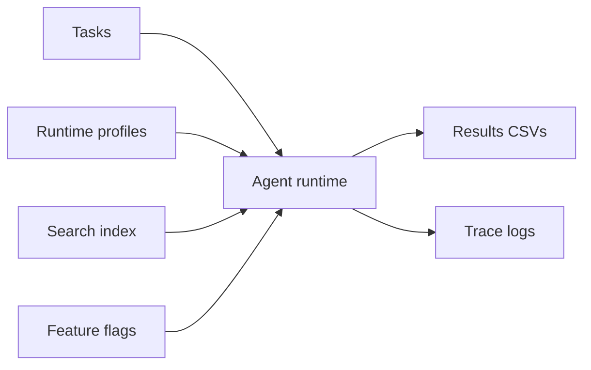
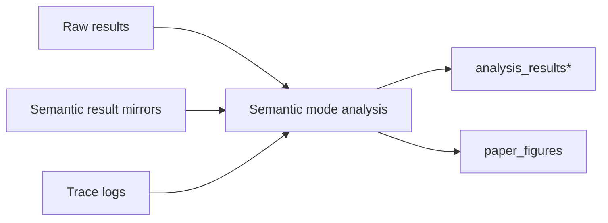

# SANA


SANA is a diagnostic ablation framework for exploratory QA over data lakes. It
turns benchmark tasks into runtime profiles containing gold source sequences,
sanitized subquestions, and execution records, then uses those profiles to
ablate search, planning guidance, and data-analysis tools under a fixed agent
runtime.

## How SANA Works

When an LLM agent fails at exploratory QA over a data lake, SANA asks which
part of the runtime is responsible. The agent normally has to decompose the
question, find the right sources, and compute the answer from those sources.
SANA replaces one stage at a time with an oracle built from the task's ground
truth. The accuracy gain from each replacement pinpoints the bottleneck.

The three stages are:

- Question decomposition: break the user question into ordered subquestions.
- Search: retrieve only the datasets or sources each subquestion needs.
- Data analysis: execute SQL or Python that matches the intended computation.



SANA profiles are the mechanism that makes those oracle swaps reproducible.
Each profile mirrors a task into source order, answer-safe subquestions, and
execution records. In a diagnostic run, the runtime can expose those profile
fields directly, hide them, or use them only inside ideal tools.





Each phase can be used independently. If you already have your own data lake,
retrieval service, or benchmark artifacts, you can replace that phase and keep
the SANA artifact contracts.

## 0. dataindexing

`dataindexing/` owns offline artifact generation and hybrid-search index
construction. This phase is only required when you want to recreate the search
indexes and benchmark-local artifacts used by our runs. External users can
instead provide their own search backend as long as the evaluation tools can
query it.



Generic LakeQA/Data.gov artifact build:

```bash
python -m dataindexing.cli.to_parquet \
  --output datalake_with_schema.parquet

python -m dataindexing.cli.parquet_to_description \
  datalake_with_schema.parquet \
  --output benchmarks/lakeqa/tasks-mini/artifacts/descriptions.jsonl \
  --parquet-output table_descriptions.parquet

python -m dataindexing.cli.build_hybrid_search \
  --embed-preset qwen3_0_6b \
  --build-mode infused \
  --parquet datalake_with_schema.parquet \
  --descriptions benchmarks/lakeqa/tasks-mini/artifacts/descriptions.jsonl \
  --schemas benchmarks/lakeqa/tasks-mini/artifacts/table_schemas_full.jsonl \
  --output lance_data
```

Kramabench artifact build:

```bash
python -m dataindexing.cli.extract_kramabench_tables \
  --eval-root . \
  --output-parquet kramabench_tables.parquet \
  --output-schemas kramabench_table_schemas.jsonl \
  --output-manifest kramabench_table_manifest.jsonl \
  --output-report kramabench_extract_report.json \
  --tables-dir kramabench_tables

python -m dataindexing.cli.parquet_to_description \
  kramabench_table_manifest.jsonl \
  --input-format auto \
  --output kramabench_descriptions.jsonl \
  --parquet-output kramabench_descriptions.parquet

python -m dataindexing.cli.build_hybrid_search \
  --embed-preset qwen3_0_6b \
  --build-mode infused \
  --parquet kramabench_tables.parquet \
  --descriptions kramabench_descriptions.jsonl \
  --schemas kramabench_table_schemas.jsonl \
  --output lance_kramabench_infused
```

## 1. sana-profiling

`sana-profiling/` contains the framework-facing workflow for turning an
external QA benchmark into LakeQA-style task artifacts and matching SANA runtime
profiles. The current conversion path is intentionally report-first: sample
benchmark examples, infer a conversion method, scaffold a transform skill from
that report, then run the generated skill on benchmark instances.



HotpotQA generated-conversion example:

```bash
python sana-profiling/skills/benchmark-lakeqa-conversion-auditor/scripts/sample_benchmark_artifacts.py \
  other-benchmarks/tasks-hotpotqa-mini \
  --limit 10 \
  > sana-profiling/examples/hotpotqa-conversion/sampled-artifacts.json

python sana-profiling/skills/benchmark-lakeqa-skill-scaffolder/scripts/scaffold_benchmark_skill.py \
  sana-profiling/examples/hotpotqa-conversion/hotpotqa-lakeqa-conversion-report.md \
  --benchmark hotpotqa \
  --output-root sana-profiling/examples/hotpotqa-conversion/generated-skills \
  --force
```

That run generated a `hotpotqa-lakeqa-transform` skill and applied it to five
sampled imports. The dry-run output is under:

- `sana-profiling/examples/hotpotqa-conversion/generated-skills/`
- `sana-profiling/examples/hotpotqa-conversion/converted/benchmarks/hotpotqa/tasks-mini/tasks/`
- `sana-profiling/examples/hotpotqa-conversion/converted/benchmarks/hotpotqa/tasks-mini/runtime-profiles/`
- `sana-profiling/examples/hotpotqa-conversion/validation.json`

Maintained benchmark examples live under:

| Benchmark | Tasks | Runtime profiles | Artifacts |
| --- | --- | --- | --- |
| LakeQA | `benchmarks/lakeqa/tasks-mini/tasks/` | `benchmarks/lakeqa/tasks-mini/runtime-profiles/` | `benchmarks/lakeqa/tasks-mini/artifacts/` |
| Kramabench | `benchmarks/kramabench/tasks-mini/tasks/` | `benchmarks/kramabench/tasks-mini/runtime-profiles/` | `benchmarks/kramabench/tasks-mini/artifacts/` |

## 2. sana-evaluation

`sana_evaluation/` runs task sets with controlled runtime axes for search,
retrieved results, planning guidance, optional skills, and computation. Use
`smoke` while checking installation and `full` for the maintained task set.





Inspect maintained artifacts:

```bash
python -m sana_evaluation.benchmarks --benchmark lakeqa --check
python -m sana_evaluation.benchmarks --benchmark kramabench --check
```

LakeQA smoke run:

```bash
python -m sana_evaluation.cli smoke \
  --benchmark lakeqa \
  --search ideal \
  --results ideal \
  --plan ideal \
  --compute ideal \
  --skills off \
  --k 5 \
  --model openai/gpt-5.4-nano \
  --db lance_data
```

Kramabench smoke run:

```bash
python -m sana_evaluation.cli smoke \
  --benchmark kramabench \
  --search ideal \
  --results ideal \
  --plan ideal \
  --compute ideal \
  --skills off \
  --k 5 \
  --model openai/gpt-5.4-nano \
  --db lance_kramabench_infused
```

Full maintained-task run:

```bash
python -m sana_evaluation.cli full \
  --benchmark kramabench \
  --search ideal \
  --results ideal \
  --plan standard \
  --compute ideal \
  --skills off \
  --k 5 \
  --parallel 4 \
  --model openai/gpt-5-mini \
  --db lance_kramabench_infused \
  --timeout 600 \
  --submit-grace-seconds 30 \
  --only-new
```

Common feature flags:

| Option | Values | Default | Use |
| --- | --- | --- | --- |
| `smoke` / `full` | preset | optional | A preset only shifts defaults. `smoke` runs one small bucket; `full` runs the maintained task set. Omit it for the raw evaluator defaults. |
| `--benchmark` | `lakeqa`, `kramabench` | `lakeqa` | Selects task roots, output roots, and benchmark-specific tool behavior. |
| `--search` | `naive`, `preloaded`, `standard`, `ideal`, `web` | `standard` (`ideal` under a preset) | Chooses the search-tool implementation exposed to the agent. |
| `--results` | `minimal`, `rich` (`naive`, `ideal` are the former names) | `rich` | Chooses how much metadata rides along with each search hit. |
| `--plan` (alias `--plans`) | `naive`, `standard`, `ideal` | `standard` (`ideal` under a preset) | Chooses the planning treatment: no planning, the managed prompt with skills and planning style, or an injected gold reasoning chain. |
| `--compute` | `standard`, `ideal` | `standard` (`ideal` under a preset) | Chooses regular data-analysis tools or profile-backed ideal computation. |
| `--skills` | `on`, `off` | omitted/off | Enables or disables the AgentSkills plugin. |
| `--k` | positive integer | unset | Search result limit passed to runtime tools. |
| `--parallel` | positive integer | `6` | Number of parallel worker processes. |
| `--model` | model name | `bedrock/claude-sonnet-4.5` | Model adapter name, for example `openai/gpt-5-mini`. |
| `--reasoning-effort` | `none`, `minimal`, `low`, `medium`, `high`, `xhigh` | unset | Reasoning-effort metadata for supported model adapters. |
| `--selector-model` | model name | `--model` | Optional weaker model for selector-style ideal helper calls. |
| `--repair-model` | model name | `--model` | Optional stronger model for ideal computation repair calls. |
| `--openai-prompt-cache-key` | string | unset | Prompt-cache key for OpenAI-backed adapters. |
| `--openai-prompt-cache-retention` | string | unset | Prompt-cache retention policy for OpenAI-backed adapters. |
| `--db` | path | `./lance_data` | LanceDB root, for example `lance_data` or `lance_kramabench_infused`. Preflight checks that it exists only under `--search standard` or `--search naive`, the two modes that query the index; the `smoke` and `full` examples above run `--search ideal`, which is served from runtime profiles and so never touches it. |
| `--timeout` | seconds | `600` | Per-task soft timeout. |
| `--submit-grace-seconds` | seconds | `30` | Extra time reserved for final answer submission after timeout. |
| `--task-dir` | path or bucket name | smoke default | Run one directory of tasks, e.g. `k-5-d-4`. |
| `--all-tasks` | flag | on for `full` | Run every task directory under `--task-set`, pooled into one worker pool. |
| `--only-new` | flag | on for `full` | Skip task files already recorded as rows in the variant's `eval_results.csv`; composes with `--all-tasks` and any other scope. |
| `--verbose` | flag | off (on under a preset) | Emits verbose per-task runtime logs. |
| `--search-free` | flag | off | Makes active search calls free against the global tool-call limit. |

## 3. sana-analysis

`sana_analysis/` consumes result CSVs, semantic mirrors, traces, and task files
to produce aggregate mode analyses and paper-ready artifacts.



### Input contract

`sana_analysis` reads the tree `sana_evaluation` writes:

```
<results>/modes/<model>/<variant>/eval_results.csv   per-task rows
<results>/traces/modes/<model>/<variant>/            per-task trace JSONL
<logs>/modes/<model>/<variant>/                      per-task run logs
```

`<variant>` is a variant directory name -- `sana_evaluation.cli` writes them and
`sana_analysis/variants.py` reads them. All four naming generations parse.

`eval_results.csv` must carry `exact_match`. Everything else the analysis needs
is either computed from the traces or produced by the semantic auditor, which
adds five columns: `semantic_match`, `semantic_reason`, `semantic_bucket`,
`log_error_bucket`, `log_error_evidence`.

### Analysing a whole experiment

```bash
./scripts/analyse.sh --experiment 2026-08-31-model-tiers-subset20b
```

Finds every round (`results/`, `results-rep2/`, ... -- some experiments name
round 1 `results-rep1/`), derives all four input paths from the round itself,
picks the judged path when a complete `<round>_semantic` mirror exists and the
`exact_match`-only path otherwise, and writes:

```
<experiment>/analysis/<round>/          one analysis per round
<experiment>/analysis/combined/         mean and spread per condition across rounds
```

`--round rep2` narrows to one round. `--tasks-dir` overrides the task set, which
is otherwise derived from the `task_id` paths the run recorded.

The combined summary pools `semantic_match` only over rounds that actually had a
judge, because an unjudged round's `semantic_match` is its `exact_match`.

`analyse.sh` calls no model. To audit rounds that have no mirror first:

```bash
./scripts/analyse_with_autoaudit.sh --experiment <name>
```

That one spends money per unaudited row, which is why it is a separate script
rather than a flag. Rounds whose mirror already exists and validates are skipped.

### Without model judging

The cheapest useful analysis needs no judge and no API key: exact-match accuracy,
cost, tool calls, search calls and precision, cycle counts.

```bash
python -m sana_analysis.run_mode_analysis \
  --results-dir results/modes \
  --base-results-dir results/modes \
  --traces-dir results/traces/modes \
  --tasks-dir benchmarks/lakeqa/tasks-mini/tasks \
  --output-dir analysis_results_mode \
  --no-semantic
```

`semantic_match` is sourced from `exact_match`, and every output that only a
judge can produce -- `failure.json`, `semantic_buckets.json`,
`log_error_buckets.json`, `semantic_error_crosstab.json`,
`semantic_delta_ablation.csv`, `paired_mode_metrics.csv` -- is **omitted from
the output directory**, not written empty. `no_semantic.json` records what was
skipped and why.

### With model judging

Audit the raw tree first. The auditor mirrors it into `<results>_semantic/`,
leaving the source untouched; cells whose mirror already exists and validates are
skipped, so re-running is a no-op on finished work.

```bash
python sana_analysis/skills/semantic-eval-auditor/scripts/rewrite_semantic_eval_results.py \
  --source results \
  --logs logs
```

Then analyse the mirror:

```bash
python -m sana_analysis.run_mode_analysis \
  --results-dir results_semantic/modes \
  --base-results-dir results/modes \
  --traces-dir results/traces/modes \
  --tasks-dir benchmarks/lakeqa/tasks-mini/tasks \
  --output-dir analysis_results_mode_semantic
```

For Kramabench, swap `--tasks-dir` for `benchmarks/kramabench/tasks-mini/tasks`
and the result and trace roots for their `-kramabench` equivalents.

Running the second command against an unaudited tree raises and names both
remedies rather than silently reporting lexical numbers as semantic ones.

### Plan similarity

The plan ablation's judged measurement -- the standard-plan arm's plan text
against the ideal arm's -- has its own runner:

```bash
python -m sana_analysis.metrics.plan_ablation_analysis logs --judge
```

Without `--judge` it prepares the pairs and costs nothing, which is the quick way
to check that both arms are present in a tree.

Package ownership:

- `dataindexing/`: offline artifact generation and hybrid-search index build.
- `sana-profiling/`: benchmark conversion workflow and runtime-profile authoring.
- `sana_evaluation/`: runners, tool wiring, instrumentation, and model adapters.
- `sana_analysis/`: result aggregation, semantic analysis, the judge skills that
  produce it, and report generation.
